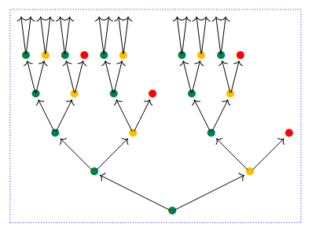

# Polynomial Functors in Agda

  

Experiments in `Poly` based on Nelson Niu and David Spivak's
[Polynomial Functors](https://topos.site/poly-book.pdf) book.

## Structure

- [src/Poly.agda](https://github.com/solomon-b/poly/blob/main/src/Poly.agda): The actual implementation of Poly.
- [src/Poly](https://github.com/solomon-b/poly/tree/main/src/Poly): Structures built using Poly
- [src/Book](https://github.com/solomon-b/poly/tree/main/src/Book): Notes and exercises from the Poly Book. This is very incomplete.
